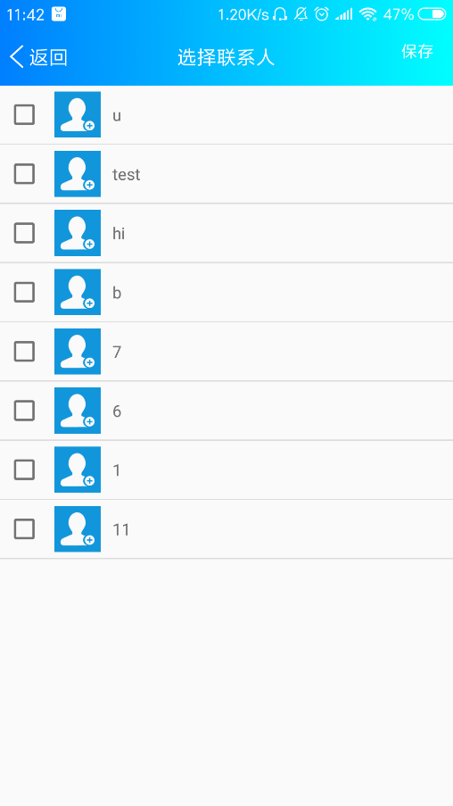

## FreeChat(畅聊，你我更接近)

 

> 鉴于一个QQ好友私聊我需要IM APP的源码，遂将之前写的一个IM APP进行整理开源。其中还有部分细节还未实现，群聊成员模块的显示有个bug还未修复，希望以后自己有空再去写一下。
>
> > 后期有空的话打算使用 **Android端+纯后端** 实现一款不借助第三方即时通讯框架的IM app。

### 一. 项目功能简介
一款IM（即时通讯）APP，界面微仿微信，通过集成环信的SDK和EaseUI实现了其中的即时通讯功能，自己实现了MyIM中的业务逻辑处理和界面设计实现。实现的核心功能有：

* 单聊
* 群聊
* 添加好友
* 新建群组

 

***

### 二. 项目运行效果

&nbsp;&nbsp;

&nbsp;&nbsp;

&nbsp;&nbsp;

&nbsp;&nbsp;

&nbsp;

 

***

### 三. 当前版本

v 1.0

 

***

### 四. APP 兼容性（使用Testin云测）

